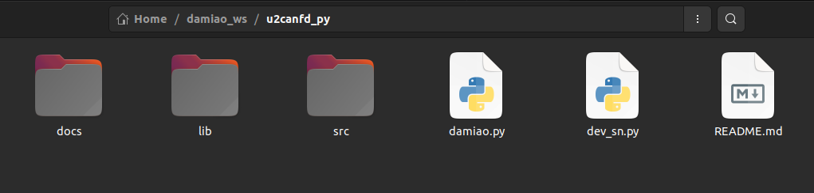

# Python example of using a USB-to-CANFD converter to drive a Damiao motor.

## Introduction
This is a Python example for controlling Damiao motors.

The required hardware is **Damiao’s USB-to-CANFD** device.

The program testing environment is **Python 3.8 and Python 3.10**.

Sets the motor with CAN ID = 0x01 and MST ID = 0x11 (DM4310 motor) to velocity mode
, Enables the motor, Makes the motor rotate, **Motor data bitrate is 5 Mbps**

***Note: When using 5 Mbps bitrate with multiple motors, a 120-ohm termination resistor must be connected to the last motor on the bus.***

## Software Architecture
python

## Installation and Compilation 
Open the terminal, and first install the Python version of the libusb library by typing:
```shell
pip3 install pyusb
```
Then open the terminal and type:
```shell
mkdir -p ~/catkin_ws
cd ~/catkin_ws
```
Then put the **u2canfd** folder from Gitee into the catkin_ws directory.

As shown below:



## Simple Use
First, use the latest host computer to set the motor baud rate to 5M.

Then grant permissions to the **USB-to-CANFD device** by entering the following in the terminal:

***Note: No permission settings are required for Mac and Windows systems.***

```shell
sudo nano /etc/udev/rules.d/99-usb.rules
```
Then write the content:
```shell
SUBSYSTEM=="usb", ATTR{idVendor}=="34b7", ATTR{idProduct}=="6877", MODE="0666"
```
Then reload and trigger:
```shell
sudo udevadm control --reload-rules
sudo udevadm trigger
```
***Note: This permission setting only needs to be set once. You do not need to reset it after restarting your computer or unplugging/plugging the device.**

Then you need to find the Serial_Number of the **USB-to-CANFD device** by running the dev_sn.py file:
```shell
cd ~/catkin_ws/u2canfd
python3 dev_sn.py
```


The string of numbers following the SN in the image above is the Serial_Number of the device.

Next, copy the Serial\_Number file, open damiao.py, and replace the Serial\_Number file in the program, as shown in the image below:


Then open the terminal and run the damiao.py file:
```shell
cd ~/catkin_ws/u2canfd
python3 damiao.py
```
At this point, you will see the motor light turn green and start rotating.

## Advanced Usage
Below is a step-by-step guide on how to use this program to simultaneously control nine DM4310 motors at a baud rate of 5 MHz and a kHz frequency.

***Note: At a 5 MHz baud rate, if there are multiple motors, a 120 ohm resistor needs to be connected to the end motor.***

1. First, use the latest host computer to set a baud rate of 5M for each motor.

2. Then define the id variable in the main function:
```shell
canid1=0x01
mstid1=0x11
canid2=0x02
mstid2=0x12
canid3=0x03
mstid3=0x13
canid4=0x04
mstid4=0x14
canid5=0x05
mstid5=0x15
canid6=0x06
mstid6=0x16
canid7=0x07
mstid7=0x17
canid8=0x08
mstid8=0x18
canid9=0x09
mstid9=0x19
```
3. Then define a list of motor information:
```shell
init_data1= []
```
4. Then fill the container with data from 9 motors:
```shell
init_data1.append(DmActData(
                    motorType=DM_Motor_Type.DM4310,  
                    mode=Control_Mode.POS_VEL_MODE,      
                    can_id=canid6,
                    mst_id=mstid6))
        init_data1.append(DmActData(
                    motorType=DM_Motor_Type.DM4310,  
                    mode=Control_Mode.POS_VEL_MODE,       
                    can_id=canid2,
                    mst_id=mstid2))
        init_data1.append(DmActData(
                    motorType=DM_Motor_Type.DM4310, 
                    mode=Control_Mode.POS_VEL_MODE,      
                    can_id=canid3,
                    mst_id=mstid3))
        init_data1.append(DmActData(
                    motorType=DM_Motor_Type.DM4340, 
                    mode=Control_Mode.POS_VEL_MODE,        
                    can_id=canid4,
                    mst_id=mstid4))
        init_data1.append(DmActData(
                    motorType=DM_Motor_Type.DM4340, 
                    mode=Control_Mode.POS_VEL_MODE,       
                    can_id=canid5,
                    mst_id=mstid5))
        init_data1.append(DmActData(
                    motorType=DM_Motor_Type.DM4340,  
                    mode=Control_Mode.POS_VEL_MODE,       
                    can_id=canid6,
                    mst_id=mstid6))
        init_data1.append(DmActData(
                    motorType=DM_Motor_Type.DM4310,  
                    mode=Control_Mode.POS_VEL_MODE,      
                    can_id=canid7,
                    mst_id=mstid7))
        init_data1.append(DmActData(
                    motorType=DM_Motor_Type.DM4310, 
                    mode=Control_Mode.POS_VEL_MODE,      
                    can_id=canid8,
                    mst_id=mstid8))
        init_data1.append(DmActData(
                    motorType=DM_Motor_Type.DM4310, 
                    mode=Control_Mode.POS_VEL_MODE,      
                    can_id=canid9,
                    mst_id=mstid9))
```
6. Then initialize the motor control structure:
```shell
with Motor_Control(1000000, 5000000,"14AA044B241402B10DDBDAFE448040BB",init_data1) as control:
```
***Note: "14AA044B241402B10DDBDAFE448040BB" above is my device's serial number (SN). You need to replace it with your device's SN. You can find your device's SN by running the dev_sn.py file, as mentioned earlier.***

7. Next, the motors can be controlled through this structure by sending MIT commands to all nine motors:
```shell
control.control_mit(control.getMotor(canid1), 0.0, 0.0, 0.0, 0.0, 0.0)
control.control_mit(control.getMotor(canid2), 0.0, 0.0, 0.0, 0.0, 0.0)
control.control_mit(control.getMotor(canid3), 0.0, 0.0, 0.0, 0.0, 0.0)
control.control_mit(control.getMotor(canid4), 0.0, 0.0, 0.0, 0.0, 0.0)
control.control_mit(control.getMotor(canid5), 0.0, 0.0, 0.0, 0.0, 0.0)
control.control_mit(control.getMotor(canid6), 0.0, 0.0, 0.0, 0.0, 0.0)
control.control_mit(control.getMotor(canid7), 0.0, 0.0, 0.0, 0.0, 0.0)
control.control_mit(control.getMotor(canid8), 0.0, 0.0, 0.0, 0.0, 0.0)
control.control_mit(control.getMotor(canid9), 0.0, 0.0, 0.0, 0.0, 0.0)
```
8. Acquire the position, speed, torque, and time interval of the data received from the motors from the nine motors:
```shell
for id in range(1,10): 
	pos = control.getMotor(id).Get_Position()
	vel = control.getMotor(id).Get_Velocity()
	tau = control.getMotor(canid1).Get_tau()
	interval = control.getMotor(id).getTimeInterval()

	print(f"canid is: {id} pos: {pos} vel: {vel} effort: {tau} time(s): {interval}", file=sys.stderr)
```
9. Achieving a control frequency of 1kHz:

***Note: This is better to use the function***
```shell
while running.is_set():
    desired_duration = 0.001  # 秒
    current_time = time.perf_counter()
   
   
    sleep_till = current_time + desired_duration
    now = time.perf_counter()
    if sleep_till > now:
        time.sleep(sleep_till - now)
```

## ## Receive Callback Explanation

In damiao.py, the function `canframeCallback(self, value:can\_value_type)`，

This function parses the received CAN message and cannot be called manually. It is passed as an argument to the usb\_class class, and a thread is started within the usb\_class class to call this function.

You can override this function to parse your own CAN message data.

The `can_value_type` data type is defined as follows:
```shell
class can_head_type:
    def __init__(self):
        self.id = 0
        self.time_stamp = 0
        self.reserve = [0, 0, 0]
        self.fram_type = 0
        self.can_type = 0
        self.id_type = 0
        self.dir = 0
        self.dlc = 0  # 4 bits, stored in lower nibble

class can_value_type:
    def __init__(self):
        self.head = can_head_type()
        self.data = [0] * 64
```


